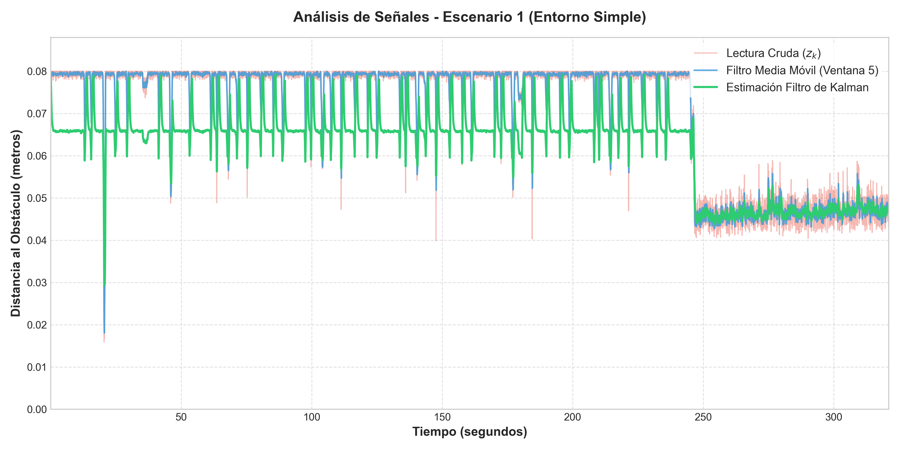
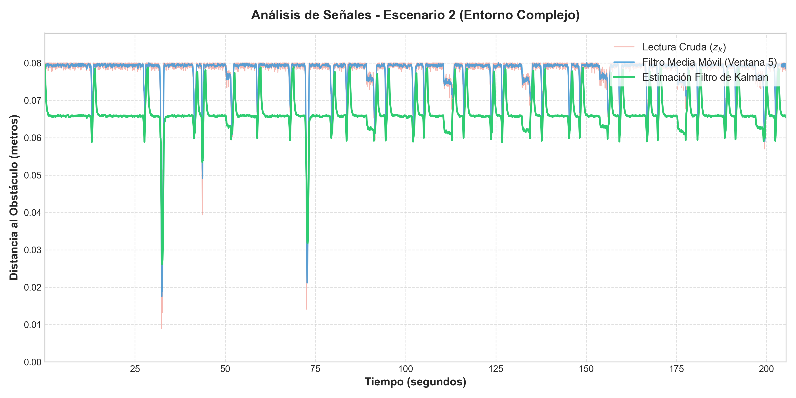

# **Laboratorio 2 Robótica**
---
## **Integrantes:**
- Vicente Nills Quezada
- Yamil Soleman Fernandez
- Sebastián García V
- Ignacio Matus de la Parra
- Vicente Aburto Falcón

## **Asignatura**
- ICI4150-2

---
## **Objetivos del Trabajo**

El objetivo de laboratorio es implementar un sistema básico de navegación reactiva en el entorno de simulación Webots para un robot móvil diferencial. Esto se realizará utilizando sensores de distancia y encoders de rueda, aplicando técnicas de filtrado sobre las mediciones y empleando un algoritmo de fusión sensorial mediante un filtro de Kalman para estimar de forma robusta la distancia frontal a los obstáculos del entorno.

### **Objetivos Específicos**

**Registro y Adquisición de Datos:** Configurar y registrar las lecturas crudas de los sensores de distancia y de los encoders de las ruedas del robot durante la simulación bajo una frecuencia de muestreo fija y constante.

**Estimación Cinemática:** Calcular el desplazamiento lineal y el avance iterativo del robot móvil a partir de las mediciones de posición angular en radianes entregadas por los encoders.

**Mitigación de Ruido Primario:** Aplicar un filtro de media móvil simple (SMA) sobre las señales de los sensores frontales para reducir las fluctuaciones y la incertidumbre inherente de los componentes electrónicos.

**Fusión Sensorial Avanzada:** Implementar un filtro de Kalman escalar estructurado explícitamente en sus fases de predicción (utilizando el avance estimado por encoders) y corrección (incorporando la lectura de los sensores frontales de distancia) para obtener una variable de proximidad estable.

**Control y Navegación Reactiva:** Diseñar e integrar una lógica algorítmica de toma de decisiones que utilice la distancia frontal fusionada por el filtro de Kalman para determinar si el robot avanza o se detiene, apoyándose además en los sensores de proximidad laterales para evadir obstáculos decidiendo la dirección óptima del giro.

**Validación en Entornos de Prueba:** Evaluar el desempeño del controlador reactivo diseñado mediante la implementación de dos escenarios diferenciados en Webots: un entorno simple con baja densidad de obstáculos y un entorno complejo compuesto por pasillos estrechos.

**Análisis Comparativo de Señales:** Analizar la estabilidad del movimiento, la reducción de giros innecesarios y la tasa de prevención de colisiones del robot al contrastar el uso de lecturas crudas, señales filtradas por media móvil y la distancia estimada mediante fusión sensorial.
## Descripción del robot y sensores utilizados

## **Parámetros de Muestreo y Registro de Datos**

Para garantizar la correcta discretización y análisis de las curvas temporales del sistema de control, se extrajeron y analizaron los parámetros fundamentales de muestreo directamente desde el controlador reactivo de Webots, sincronizados mediante el reloj de simulación básica (`robot.getBasicTimeStep()`).

A continuación, se detallan las variables de muestreo utilizadas de manera idéntica en ambos escenarios de prueba:

| Parámetro de Muestreo | Valor Calculado | Unidad | Descripción Técnica |
| :--- | :--- | :--- | :--- |
| **Tiempo de Muestreo ($T_s$)** | `0.032` | Segundos (s) | Intervalo de tiempo discreto fijado por el paso básico de Webots (32 ms) entre iteraciones consecutivas del bucle de control. |
| **Frecuencia de Muestreo ($f_s$)** | `31.25` | Hertz (Hz) | Tasa de refresco del procesamiento digital, calculada mediante la relación formal matemática: $f_s = \frac{1}{T_s}$. |
| **Total de Muestras Registradas** | `5.926` | Muestras | Cantidad total de estados discretos exportados al archivo CSV durante el recorrido completo del robot. |

### Gráficos de Señales Comparativas (Cruda vs. Filtrada vs. Kalman)

Utilizando los datos analíticos recolectados, se generaron las curvas continuas de distancia métrica con el propósito de evaluar el comportamiento del ruido electrónico del sensor frontal y el rendimiento de mitigación de los algoritmos implementados.

#### Escenario 1: Entorno Simple

#### Escenario 2: Entorno Complejo (Pasillos)

## **Marco Teórico y Fórmulas Matemáticas**

### Estimación del Avance mediante Encoders

Para estimar el desplazamiento lineal del robot a partir del giro de sus ruedas, nos basamos en la relación geométrica fundamental entre el despalzamiento angular y el lineal. Teniendo en cuenta que los encoders del robot e-puck registran el giro en radianes y que el radio de sus ruedas configurado en el controlador es de $0.0205 m$, la conversión se define mediante la siguiente ecuanción:

$$s = r\theta$$

Donde:
* $s$: Corresponde al desplazamiento lineal (en metros).
* $r$: Representa el radio de la rueda ($0.0205 m$).
* $\theta$: Es el desplazamiento angular acumulado que mide el encoder (en radianes).

Para el cálculo iterativo dentro del ciclo de control, se evalúa el avance en cada instante $$ calculando la diferencia de ángulo respecto a la lectura anterior $k - 1$:

$$\Delta s = r (\theta_{k} - \theta_{k-1})$$

Este delta de desplazamiento ($\Delta s$) es la base para predecir cómo cambia la distancia hacia un obstáculo frontal.

### Filtro Simple: Media Móvil

Los sensores infrarrojos de proximidad tienen ruido e incertidumbre inherente en sus lecturas. Para estabilizar la señal antes de tomar decisiones reactivas, implementamos un filtro de media móvil (Simple Moving Average - SMA).

Conceptualemente hablando, este filtro funciona almacenando las lecturas recientes en un buffer de memoria y calculando su promedio. En nuestro controlador, decidimos optar por una ventana de 5 muestras. Esta cantidad de muestras ofrece un equilibrio ideal, donde es lo suficientemente grande para suavizar las fluctuaciones de alta frecuencia (ruido), pero lo suficientemente pequeña para no introducir un desfase de tiempo crítico que provoque colisiones tardías.

La formulación matemática del filtro aplicado es: 

$$SMA_{k} = \frac{1}{5} \sum_{i = 0}^{4} z_{k - i}$$

Donde $z_{k - i}$ es la lectura cruda del sensor frontal en el instante evaluado.

### Fusión Sensorial: Ecuaciones del Filtro de Kalman

Para poder lograr una estimación robusta y confiable de la distancia frontal al obstáculo más cercano, aplicamos un Filtro de Kalman escalar (unidimensional). Este modelo estadístico fusiona la predicción obtenida del modelo cinemático (encoders) con la corrección obtenida del entorno (sensores de distancia).

En el controlador, el estado inicial de la distancia estimada se definió en 0.08 m, y establecimos los siguientes parámetros fijos de covarianza:

* Ruido del proceso ($Q$): Se fijó en $0.001$, asumiendo una alta confianza en la precisión del movimiento calculado por los encoders.
* Ruido de la medición ($R$): Se fijó en $0.05$, lo que representa la varianza o ruido esperado de los sensores infrarrojos frontales.
* Covarianza del error inicial ($P$): Se inicializó en $1.0$.

El algoritmo opera iterativamente en dos etapas:

1. Etapa de Predicción: A partir del estado anterior, se estima el estado actual utilizando el avance del robot. Si el robot avanza hacia adelante ($\Delta s$), la distancia hacia el obstáculo frontal disminuye en esa misma proporción.

$$\hat{d}_{k}^{-} = \hat{d}_{k-1} - \Delta s$$

* Luego se actualiza la covarianza a priori sumando el ruido del proceso:

$$P_{k}^{-} = P_{k-1} + Q$$

2. Etapa de Corrección: La predicción se ajusta integrando la nueva lectura filtrada del sensor frontal ($z_{k}$). Primero, se determina la Ganancia de Kalman ($K_{k}$), la cual decide qué tanto confiar en la medición versus la predicción:

$$K_{k} = \frac{P_{k}^{-}}{P_{k}^{-} + R}$$

* Luego se calcula la estimación final actualizada de la distancia:

$$\hat{d}_{k} = \hat{d}_{k}^{-} + K_{k}(z_{k} - \hat{d}_{k}^{-})$$

* Y por último, se actualiza la covarianza del error, preparándola para el siguiente ciclo:

$$P_{k} = (1 - K_{k}) P_{k}^{-}$$

